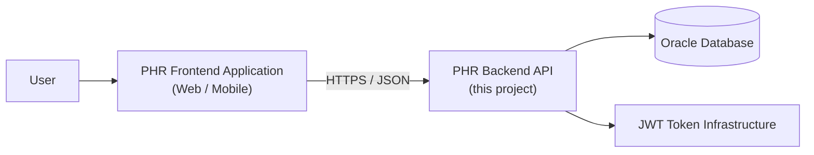
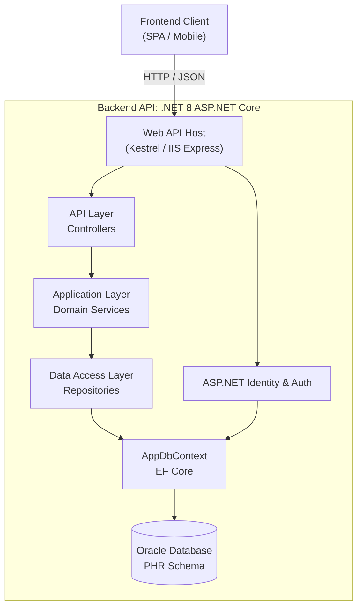
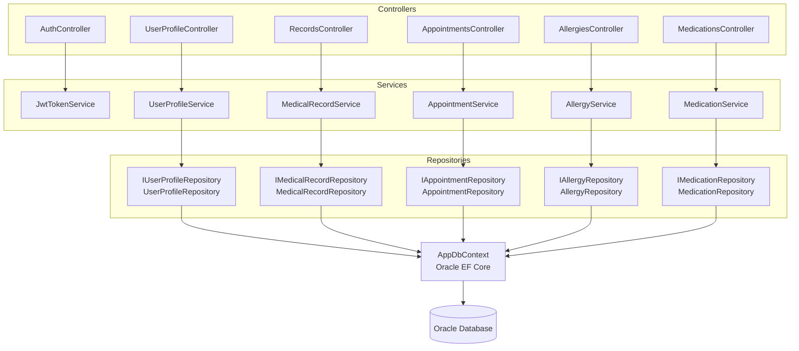
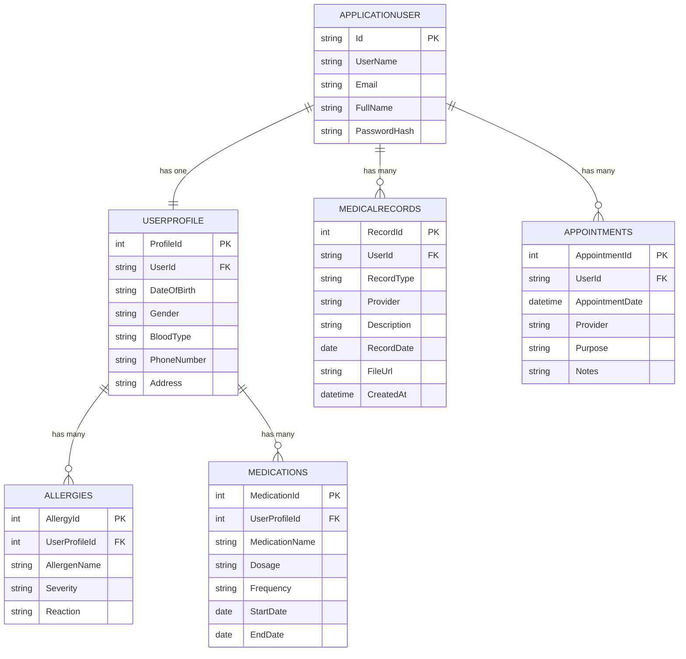
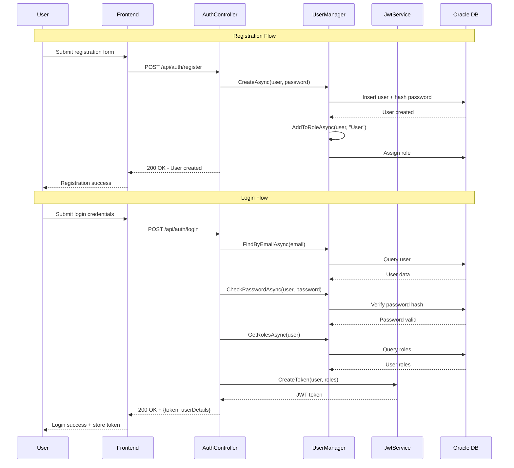
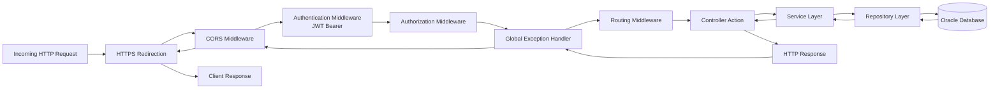
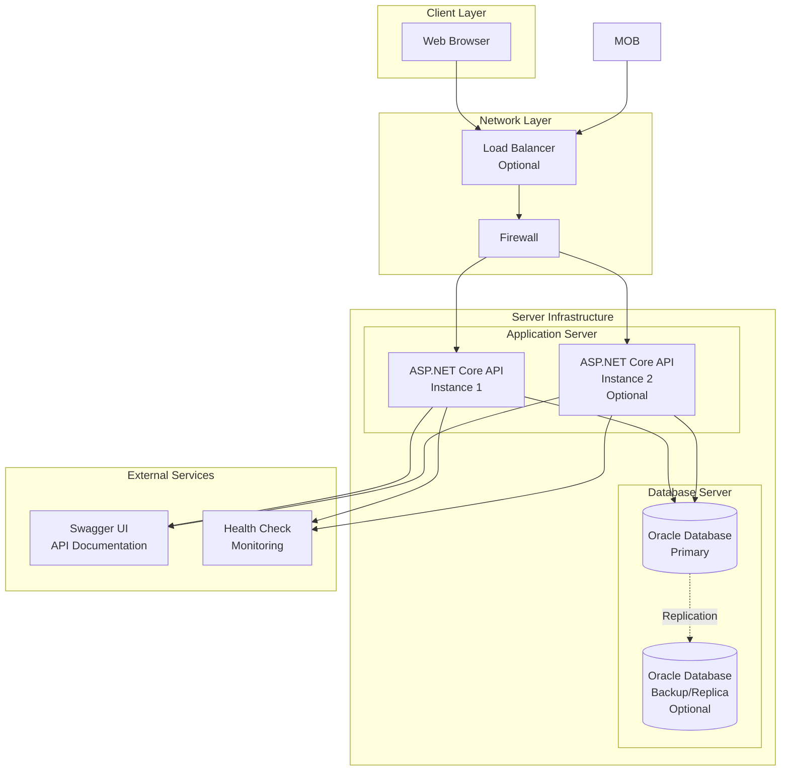
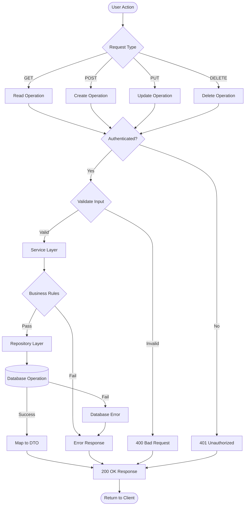

## Personal Health Record Management – Backend (ASP.NET Core, Oracle, JWT)

This repository contains the **backend API** for a Personal Health Record (PHR) system built on **ASP.NET Core 8**, **Entity Framework Core 9**, **Oracle Database**, and **JWT-based authentication**.  
It provides secure endpoints for managing **users, profiles, medical records, appointments, allergies, and medications**, along with role-based access and structured domain layers (Controllers → Services → Repositories → DbContext → Oracle).

---

## Table of Contents

- **Overview**
- **High-Level Architecture**
- **C4-style Diagrams**
  - System Context (C1)
  - Container Diagram (C2)
  - Component Diagram (C3 – backend focus)
  - Request/Response Flow
- **Domain Model**
  - Domain Model ER Diagram
- **Additional Architecture Diagrams**
  - Authentication Flow Diagram
  - Middleware Pipeline Diagram
  - Deployment Architecture Diagram
  - Data Flow Diagram
- **Project Structure**
- **Technology Stack**
- **Configuration**
- **Getting Started**
  - Prerequisites
  - Local setup
  - Database migrations
  - Running the API
- **API Surface (High-Level)**
- **Cross-Cutting Concerns**
  - Authentication & Authorization
  - Global Exception Handling
  - CORS
  - Health Checks
- **Testing**
- **Development & Coding Guidelines**
- **Troubleshooting**
- **Using Diagrams in Technical Documents**

---

## Overview

The **Personal Health Record Management** backend exposes RESTful APIs to:

- **Authenticate users** (register, login) using ASP.NET Identity + JWT.
- Manage **user profiles** (demographic and health-related data).
- Manage **medical records** (record type, provider, descriptions, dates, file URLs).
- Manage **appointments**, **allergies**, and **medications**.
- Enforce that every domain resource is **scoped to the logged-in user**.
- Persist data in an **Oracle database**, using Entity Framework Core with code-first migrations.

The backend is designed to be consumed by any frontend client (e.g., React, Angular, Vue, mobile apps) via HTTP/JSON and is documented with **Swagger/OpenAPI**.

---

## High-Level Architecture

The solution follows a typical layered architecture:

- **API Layer (Controllers)**  
  - ASP.NET Core MVC controllers, responsible for HTTP handling, validation, and mapping to services.

- **Application Layer (Services)**  
  - Business logic and orchestration, working with repositories and DTOs.

- **Data Access Layer (Repositories + DbContext)**  
  - Repository interfaces and their implementations using **EF Core**.
  - `AppDbContext` maps entities to tables and configures relationships and Oracle-specific settings.

- **Infrastructure / Cross-Cutting**  
  - ASP.NET Identity for authentication/authorization and roles.
  - JWT token generation and validation.
  - CORS, Logging, Global Exception Middleware, Health Checks.

---

## C4-style Diagrams

> **Note**: These diagrams are available in both **Mermaid code** (rendered automatically on GitHub/GitLab) and **image format** (PNG/SVG).  
> The images should be placed in a `diagrams/` folder at the root of the repository.  
> To export Mermaid diagrams as images, paste each code block into `https://mermaid.live` and download as PNG/SVG.

### System Context Diagram (C1)


*Figure 1: System Context Diagram showing the relationship between users, frontend, backend API, and Oracle database.*



**Key relationships**
- **User → Frontend**: User interacts via browser/mobile.
- **Frontend → Backend API**: Auth + CRUD on PHR resources.
- **Backend → Oracle DB**: Persistence for identity and health records.
- **Backend → JWT**: Issues and validates tokens for secured endpoints.

---

### Container Diagram (C2)


*Figure 2: Container Diagram showing the layered architecture of the backend API.*



---

### Component Diagram (C3 – Backend Focus)


*Figure 3: Component Diagram showing the detailed structure of Controllers, Services, Repositories, and their relationships.*



---


## Domain Model (Key Entities & Relationships)

**Entities** (in `Models`):

- **`ApplicationUser`**  
  - Inherits from ASP.NET Identity user.  
  - Has one-to-one relationship with `UserProfile`.

- **`UserProfile`**  
  - One-to-one with `ApplicationUser` (`UserProfile.UserId` as FK).  
  - One-to-many relationships with `Allergies` and `Medications`.

- **`MedicalRecords`**  
  - Linked to `ApplicationUser` via `UserId`.  
  - Contains `RecordType`, `Provider`, `Description`, `RecordDate`, `FileUrl`, `CreatedAt`.

- **`Appointments`**  
  - Linked to `ApplicationUser` via `UserId`.  
  - Captures appointment date/time, provider, purpose, etc.

- **`Allergies` & `Medications`**  
  - Linked to `UserProfile` via `UserProfileId`.  
  - Store allergy and medication-related properties.

**Relationships** (configured in `AppDbContext`):

- `ApplicationUser` 1–1 `UserProfile` (unique `UserId` constraint).
- `ApplicationUser` 1–* `Appointments`.
- `ApplicationUser` 1–* `MedicalRecords`.
- `UserProfile` 1–* `Allergies`.
- `UserProfile` 1–* `Medications`.
- All bool properties are mapped to Oracle `NUMBER(1)` and **table/column names are uppercased**.

### Domain Model ER Diagram


*Figure 5: Entity-Relationship Diagram showing all database entities and their relationships.*



---

## Project Structure

```text
PersonalHealthRecordManagement.sln
└── PersonalHealthRecordManagement/
    ├── Program.cs                         # Composition root & middleware pipeline
    ├── appsettings.json                   # Base configuration (Oracle, JWT, CORS)
    ├── Controllers/
    │   ├── AuthController.cs              # Register / login
    │   ├── UserProfileController.cs
    │   ├── RecordsController.cs           # Medical records CRUD for current user
    │   ├── AppointmentsController.cs
    │   ├── AllergiesController.cs
    │   ├── MedicationsController.cs
    │   └── BaseController.cs              # Shared helpers (current user, responses)
    ├── Data/
    │   └── AppDbContext.cs                # EF Core DbContext, mapping & conventions
    ├── DTOs/                              # Request/response DTO definitions
    ├── Middleware/
    │   └── GlobalExceptionHandlerMiddleware.cs
    ├── Migrations/                        # EF Core migrations for Oracle
    ├── Models/                            # EF/Core entity classes
    ├── Repositories/                      # Repository interfaces + implementations
    ├── Services/                          # Business services + JwtTokenService
    ├── Tests/
    │   ├── AppointmentControllerTest.cs
    │   ├── AppointmentServiceTest.cs
    │   ├── RecordControllerTest.cs
    │   └── RecordServiceTest.cs
    └── PersonalHealthRecordManagement.csproj
```

---

## Technology Stack

- **Runtime & Framework**
  - .NET 8 (`net8.0`)
  - ASP.NET Core Web API

- **Authentication & Security**
  - ASP.NET Core Identity (`Microsoft.AspNetCore.Identity.EntityFrameworkCore`)
  - JWT Bearer Auth (`Microsoft.AspNetCore.Authentication.JwtBearer`)
  - Custom `JwtTokenService` for token creation.

- **Persistence**
  - Entity Framework Core 9 (`Microsoft.EntityFrameworkCore`, `Microsoft.EntityFrameworkCore.Tools`, `Microsoft.EntityFrameworkCore.Design`)
  - Oracle EF Core Provider (`Oracle.EntityFrameworkCore`)

- **API Tooling**
  - Swagger / Swashbuckle (`Swashbuckle.AspNetCore`)

- **Testing**
  - xUnit
  - Moq
  - FluentAssertions
  - `Microsoft.NET.Test.Sdk`

---

## Configuration

### `appsettings.json`

- **Logging**
  - Configures log levels for default and ASP.NET components.

- **CORS / Allowed Origins**
  - `AllowedOrigins`: array of allowed frontend origins (e.g. `http://localhost:3000`, `5173`, `4200`).

- **Database**
  - `ConnectionStrings:DefaultConnection` – Oracle connection string, e.g.:
    - `User Id=system;Password=1234;Data Source=//localhost:1521/xe;`

- **JWT**
  - `Jwt:Key` – symmetric signing key (keep secret in production!).
  - `Jwt:Issuer` – token issuer (`PHRAPI`).
  - `Jwt:Audience` – token audience (`PHRAPIUSERS`).
  - `Jwt:ExpiresMinutes` – token lifetime.

> **Important**: For production, never commit real secrets; use environment variables or secure configuration providers.

---

## Getting Started

### Prerequisites

- **.NET 8 SDK** installed.
- **Oracle Database** (e.g., XE or standard edition) running and accessible.
  - Listener configured (e.g. `localhost:1521/xe`).
  - A user/schema with required privileges or use `system` for dev only.
- **EF Core Tools** (optional but recommended for migrations):

```bash
dotnet tool install --global dotnet-ef
```

---

### 1. Clone the repository

```bash
git clone <your-repo-url>
cd capstone-backend-phr-feat-refactor
```

---

### 2. Configure the database & JWT

Open `PersonalHealthRecordManagement/appsettings.json` and update:

- **Connection string** (`ConnectionStrings:DefaultConnection`) with your own Oracle host, port, service name, username, and password.
- **Jwt:Key**, **Issuer**, **Audience** if needed.
- **AllowedOrigins** to match your frontend URLs.

You can also override via environment-specific configuration (e.g., `appsettings.Development.json`) or environment variables.

---

### 3. Restore dependencies

From the solution root:

```bash
cd PersonalHealthRecordManagement
dotnet restore
```

---

### 4. Apply database migrations

Migrations are located in the `Migrations` folder and are also executed at app startup via `db.Database.Migrate()` in `Program.cs`.  
Recommended process during development:

```bash
cd PersonalHealthRecordManagement

# Ensure the connection string for DefaultConnection is valid

# Apply migrations explicitly
dotnet ef database update
```

At runtime, the app will log:
- “Applying database migrations…”  
- “Database migrations applied successfully.”  
or log an error if migration fails.

---

### 5. Run the API

From `PersonalHealthRecordManagement/`:

```bash
dotnet run
```

The application will:

- Start the ASP.NET Core Kestrel server.
- Apply pending migrations (if any).
- Seed the **roles** `Admin` and `User` if they do not exist.
- Expose:
  - **Swagger UI** at `/swagger` (in Development).
  - **Health check** endpoint at `/health`.
  - API endpoints under `/api/...`.

---

## API Surface (High-Level)

> **Note**: Exact route names and payloads can be explored via Swagger UI or by inspecting controllers.

- **Authentication (`AuthController`)**
  - `POST /api/auth/register` – register a new user.
  - `POST /api/auth/login` – login, returns JWT and user details.

- **User Profile (`UserProfileController`)**
  - CRUD operations for the current user's profile.

- **Medical Records (`RecordsController`)**
  - `GET /api/records` – list medical records for current user.
  - `GET /api/records/{id}` – get a specific record (current user only).
  - `POST /api/records` – create a record for current user.
  - `PUT /api/records/{id}` – update a record for current user.
  - `DELETE /api/records/{id}` – delete a record for current user.

- **Appointments (`AppointmentsController`)**
  - CRUD endpoints for user-specific appointments.

- **Allergies (`AllergiesController`)**
  - CRUD endpoints for allergy data associated with the user’s profile.

- **Medications (`MedicationsController`)**
  - CRUD endpoints for user medications linked to the user’s profile.

- **Utility**
  - `GET /health` – simple health check for monitoring.
  - `WeatherForecastController` – sample/demo endpoint.

All resource controllers (records, appointments, allergies, medications, profile) use the **current user ID from the JWT** to ensure users can only access their own data.

---

## Additional Architecture Diagrams

### Authentication Flow Diagram


*Figure 6: Sequence diagram showing the registration and login authentication flows.*



### Middleware Pipeline Diagram


*Figure 7: Flowchart showing the complete middleware pipeline and request processing flow.*



### Deployment Architecture Diagram


*Figure 8: Deployment architecture showing client layer, network layer, server infrastructure, and external services.*



### Data Flow Diagram (CRUD Operation Example)


*Figure 9: Flowchart showing the complete data flow for CRUD operations including authentication, validation, business rules, and error handling.*



---

- **Identity configuration** (in `Program.cs`):
  - Password rules (min length, digits, uppercase/lowercase).
  - User and role stores via `AppDbContext`.
- **JWT configuration**:
  - Default authentication scheme: `JwtBearerDefaults.AuthenticationScheme`.
  - Validates **Issuer**, **Audience**, **Signing Key**, and **Lifetime**.
- **Roles**:
  - `Admin`, `User` created at startup if missing.
  - Controllers can use `[Authorize]` and role policies (extend as needed).

### Global Exception Handling

- `GlobalExceptionHandlerMiddleware` is added into the pipeline:
  - Catches unhandled exceptions.
  - Logs errors.
  - Returns consistent error responses.

### CORS

- Configured using `builder.Services.AddCors` with `AllowedOrigins` from configuration.
- Policy:
  - Allows any method and header.
  - Allows credentials.

### Health Checks

- `builder.Services.AddHealthChecks()` and `app.MapHealthChecks("/health")`.
- Designed for use with load balancers, Kubernetes, or monitoring systems.

---

## Testing

Tests are located under `PersonalHealthRecordManagement/Tests`:

- **Unit/Integration tests (examples):**
  - `AppointmentControllerTest.cs`
  - `AppointmentServiceTest.cs`
  - `RecordControllerTest.cs`
  - `RecordServiceTest.cs`

**Test stack:**

- **xUnit** – test framework.
- **Moq** – mocking dependencies (e.g., services, repositories).
- **FluentAssertions** – expressive assertions.

Run tests from the `PersonalHealthRecordManagement` project directory:

```bash
dotnet test
```

---

## Development & Coding Guidelines

- **Layered separation**:
  - Keep controllers lean (HTTP + model binding, minimal business logic).
  - Put business rules into `Services`.
  - Keep persistence logic in `Repositories` and `AppDbContext`.

- **DTO usage**:
  - Use DTOs (from `DTOs` folder) for request and response payloads.
  - Avoid exposing EF entities directly to external clients when possible.

- **Error handling**:
  - Prefer using the global exception middleware for unhandled cases.
  - Return meaningful error messages and proper HTTP status codes.

- **Security**:
  - Protect sensitive configuration values.
  - Validate model state for all input DTOs.
  - Restrict access via `[Authorize]` or roles when exposing admin-specific endpoints.

---

## Troubleshooting

- **App fails to connect to Oracle**
  - Check `DefaultConnection` string (host, port, service name, credentials).
  - Ensure Oracle listener is up and reachable from the machine running the API.
  - Confirm that the Oracle EF Core provider version matches your Oracle DB version.

- **Migrations fail on startup**
  - Try running `dotnet ef database update` manually to see detailed errors.
  - Confirm the user has permissions to create/alter tables.
  - Review the logs emitted during app startup (`Applying database migrations...`).

- **CORS errors from frontend**
  - Ensure the frontend URL is present in `AllowedOrigins`.
  - Verify protocol/port (e.g., `http://localhost:5173` vs `https://...`).

- **JWT / 401 Unauthorized**
  - Ensure the `Authorization: Bearer <token>` header is included.
  - Confirm the token is not expired and the **Audience/Issuer** match server configuration.
  - If keys changed, old tokens will no longer work; log in again to obtain a fresh token.

---

## Extending the System

- **New domain module** (e.g., lab results, imaging records):
  - Add entity to `Models`.
  - Configure relationships in `AppDbContext`.
  - Create repository interface + implementation.
  - Create service interface + implementation.
  - Add controller endpoints and corresponding DTOs.
  - Add tests for service and controller.

- **Additional auth features**:
  - Add role-based policies or custom authorization handlers.
  - Implement refresh tokens or multi-factor auth as needed.

---


